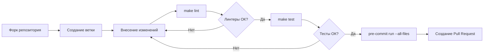

# Руководство по участию в разработке

Благодарим за интерес к проекту K_I_L_O! Любая помощь приветствуется:
баг-репорты, pull request'ы, улучшение документации.

---

## Оглавление

- [Настройка окружения](#настройка-окружения)
- [Процесс разработки](#процесс-разработки)
- [Стиль кода и линтеры](#стиль-кода-и-линтеры)
- [Тестирование](#тестирование)
- [Git и коммиты](#git-и-коммиты)
- [Документация](#документация)
- [Создание Pull Request](#создание-pull-request)
- [Отчёт об ошибках](#отчёт-об-ошибках)

---

## Настройка окружения

```bash
# 1. Форк и клонирование
git clone https://github.com/YOUR_USERNAME/K_I_L_O.git
cd K_I_L_O

# 2. Зависимости
make git-hooks          # Установка pre-commit хука
pre-commit install      # Установка 24 pre-commit хуков
uv sync                 # Установка Python-зависимостей
npm install             # Установка npm-зависимостей

# 3. Верификация
make lint               # Запуск всех линтеров (12 шт.)
make test               # Запуск тестов (BATS, 35 шт.)
```

**Необходимые инструменты:**

```bash
# Системные
sudo apt-get install -y git curl wget build-essential python3 shellcheck

# Node.js 22 LTS
curl -fsSL https://deb.nodesource.com/setup_22.x | sudo -E bash -
sudo apt-get install -y nodejs

# Python-инструменты
curl -LsSf https://astral.sh/uv/install.sh | sh
export PATH="$HOME/.local/bin:$PATH"
uv tool install ruff mypy bandit pre-commit commitizen codespell

# Go-инструменты
go install github.com/zricethezav/gitleaks/v8@latest
go install github.com/rhysd/actionlint/cmd/actionlint@latest
```

Полный список инструментов и их назначение — в [TECHNICAL_REFERENCE.md](docs/TECHNICAL_REFERENCE.md#23-ручная-установка-зависимостей).

---

## Процесс разработки



### Ветки

- Названия веток на английском, kebab-case:
  - `feature/название-фичи`
  - `fix/описание-исправления`
  - `docs/что-обновлено`
  - `refactor/что-переработано`

### Синхронизация конфигов

После изменения файлов в `.kilo/` (агенты, команды, конфигурация):

```bash
make sync          # .kilo/ → src/kilo-config/
make sync-check    # Проверка, что зеркало актуально
```

---

## Стиль кода и линтеры

Проект использует 12 автоматизированных линтеров:

```bash
make lint  # Запуск всех сразу
```

| Линтер | Область | Конфигурация |
|--------|---------|-------------|
| `shellcheck` | `.sh`, `.bash`, `.bats` | `.shellcheckrc` |
| `shfmt` | `.sh`, `.bash`, `.bats` | `-i 2 -bn -ci` |
| `yamllint` | `.yml`, `.yaml` | `.yamllint.yml` |
| `markdownlint` | `.md` | `.markdownlint.yml` |
| `json5` | `.jsonc` | — |
| `actionlint` | `.github/workflows/*.yml` | — |
| `ruff` | `.py` | `pyproject.toml` |
| `ruff-format` | `.py` | `pyproject.toml` |
| `mypy` | `.py` | `pyproject.toml` |
| `bandit` | `.py` | `.bandit` |
| `codespell` | Все текстовые | `.pre-commit-config.yaml` |
| `gitleaks` | Git-история | `.gitleaksignore` |

### Python (ruff + mypy + bandit)

```bash
# Авто-форматирование
ruff format gui/server.py

# Проверка типов
mypy gui/server.py scripts/lib.py

# Безопасность
bandit -r . --configfile .bandit
```

**Правила ruff:**

```toml
# pyproject.toml
[tool.ruff.lint]
select = ["F", "E", "W", "I", "N", "UP", "RUF", "SIM", "COM"]
ignore = ["E501", "COM812", "RUF100", "RUF001", "RUF002"]
```

### Shell (shellcheck + shfmt)

```bash
# Проверка
shellcheck -x -Calways install.sh

# Форматирование
shfmt -w -i 2 -bn -ci install.sh
```

---

## Тестирование

```bash
make test           # Все тесты (BATS)
make test-bats      # То же
```

**Тестовые файлы:**

| Файл | Описание | Количество тестов |
|------|----------|------------------|
| `tests/test_lib.bats` | Функции `scripts/lib.sh` | 13 |
| `tests/test_install.bats` | `install.sh` базовые проверки | 8 |
| `tests/test_preflight.bats` | Pre-flight проверка | 1 |
| `tests/test_verify.bats` | Верификация установки | 2 |
| `tests/test_uninstall.bats` | Удаление | 2 |
| `tests/test_sync.bats` | Синхронизация конфигов | 3 |

### Написание тестов

Тесты используют [BATS](https://github.com/bats-core/bats-core). Пример:

```bash
#!/usr/bin/env bats

setup() {
    load '../scripts/lib.sh'
    export INSTALL_DRY_RUN=0
}

teardown() {
    rm -rf "$TEMP_DIR"
}

@test "check_cmd: существующая команда возвращает 0" {
    run check_cmd "bash"
    [ "$status" -eq 0 ]
}

@test "manifest_init: создаёт manifest.json" {
    manifest_init
    [ -f "$MANIFEST_FILE" ]
}
```

---

## Git и коммиты

### Сообщения коммитов

Формат: [Conventional Commits](https://www.conventionalcommits.org/) на русском языке:

```text
тип: краткое описание (повелительное наклонение)
Подробное описание при необходимости.
```

**Типы:**
- `feat:` — новая функциональность
- `fix:` — исправление ошибки
- `docs:` — документация
- `refactor:` — переработка кода без изменения функциональности
- `test:` — тесты
- `chore:` — обслуживание (зависимости, CI, конфиги)
- `style:` — форматирование, lint

**Примеры:**

```text
feat: добавить агент obd2-specialist
fix: исправить привязку GUI к 0.0.0.0
docs: обновить CHANGELOG для v1.3.0
chore: добавить codespell в pre-commit хуки
```

### Инструменты

```bash
# Проверка последнего коммита
make lint-git-commits    # gitlint

# Интерактивный коммит
cz commit                # commitizen

# Генерация changelog
make changelog           # cz changelog

# Поднятие версии
make bump                # cz bump
```

---

## Документация

Документация находится в `docs/` и пишется на русском языке в формате Markdown.

```text
docs/
├── TECHNICAL_REFERENCE.md   # Полный технический справочник
├── ARCHITECTURE.md          # Архитектура
├── CONFIGURATION.md         # Конфигурация Kilo
├── SCRIPTS.md               # Документация скриптов
├── DEVELOPMENT.md           # Руководство разработчика
├── GUIDE.md                 # Руководство пользователя
├── KILO-VSCODE.md           # Интеграция с VS Code
└── TROUBLESHOOTING.md       # Устранение неполадок
```

**Требования к документации:**
- Язык: русский
- Код примеров: английский (комментарии русские)
- Заголовки: `## Раздел`, `### Подраздел`
- Допустимы Mermaid-диаграммы
- Все fenced code blocks должны иметь указание языка
- **Перед коммитом**: `make lint-markdown`

---

## Создание Pull Request

1. **Форкните** репозиторий на GitHub
2. **Создайте ветку** от `main`:

   ```bash
   git checkout -b feature/моя-фича main
   ```

3. **Внесите изменения** и закоммитьте
4. **Запустите проверки**:

   ```bash
   make lint
   make test
   pre-commit run --all-files
   ```

5. **Запушьте** ветку:

   ```bash
   git push origin feature/моя-фича
   ```

6. **Откройте Pull Request** на GitHub

### Чек-лист перед PR

- [ ] `make lint` — 0 ошибок
- [ ] `make test` — все тесты пройдены
- [ ] `pre-commit run --all-files` — 24/24 хука
- [ ] Если добавлен новый агент: `make sync && make sync-check`
- [ ] Если изменён `install.sh`: проверены `--check`, `--dry-run`, `--verify`
- [ ] Если изменён Makefile: обновлён `.PHONY`
- [ ] CHANGELOG.md обновлён (если изменения значимые)

---

## Отчёт об ошибках

Создавайте issue на GitHub с пометкой:

- **Заголовок**: краткое описание (например, `install.sh: ошибка при --check на Fedora`)
- **Окружение**: ОС, версия Python, Node.js
- **Шаги воспроизведения**: что сделали, что ожидали, что произошло
- **Логи**: приложите `/tmp/kilo-install-*.log` если есть
- **Скриншоты**: если ошибка в GUI

**Пример:**

```markdown
## Окружение
- ОС: Linux Mint 22
- Python: 3.12.3
- Node.js: 22.13.1

## Шаги
1. `make check`
2. Вывод: [✗] Интернет недоступен

## Ожидание
[✓] Доступ к github.com

## Дополнительно
Работает `curl https://github.com` из терминала.
```

---

## Лицензия

Проект распространяется под лицензией MIT. См. [LICENSE](LICENSE) для подробностей.
