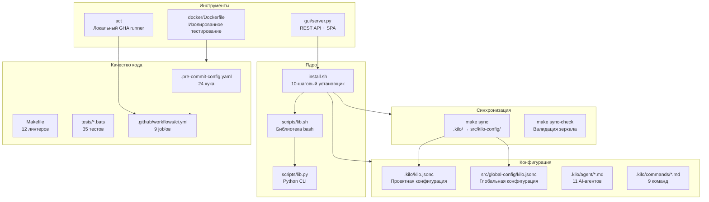
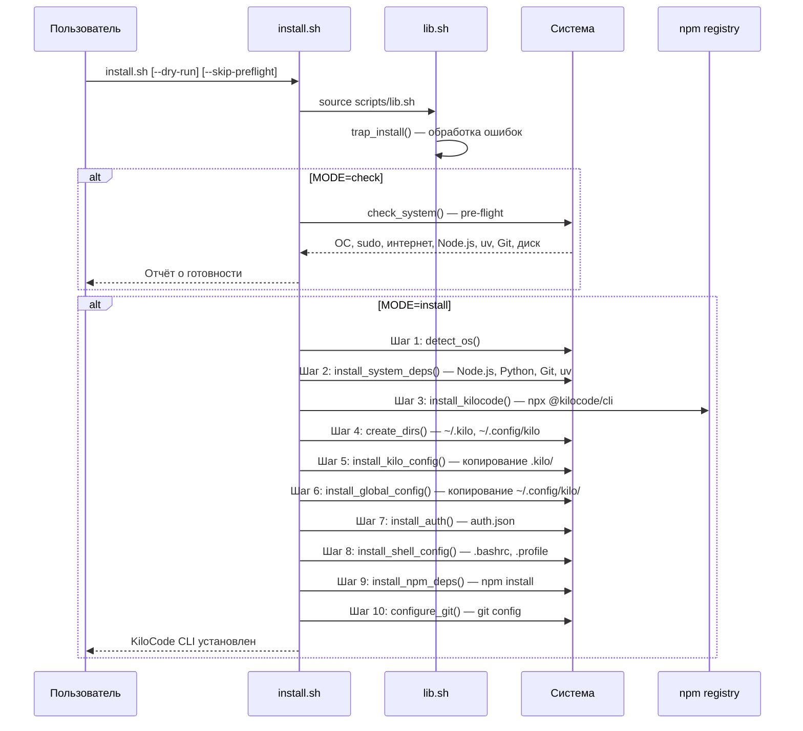
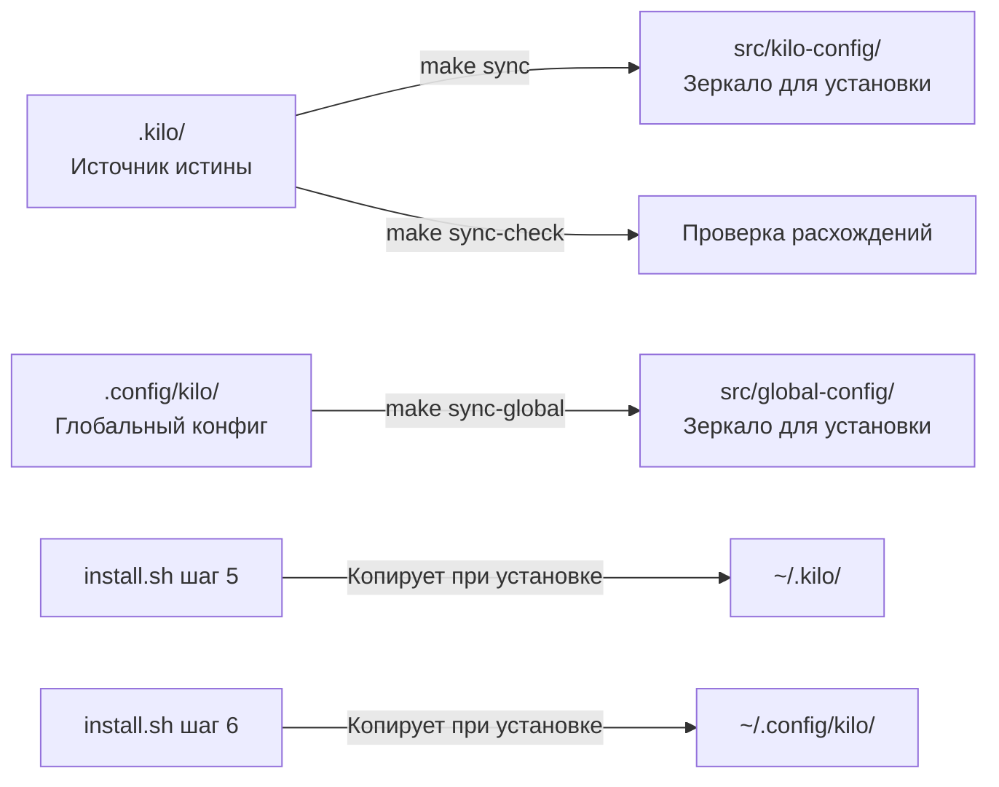

# Техническая документация K_I_L_O

> **Версия:** 1.2.0 | **Python:** ≥3.12 | **Node.js:** 22 | **Лицензия:** MIT
> **Репозиторий:** <https://github.com/ZDarow/K_I_L_O>

---

## Оглавление

- [1. Архитектурный обзор](#1-архитектурный-обзор)
  - [1.1 Общая структура](#11-общая-структура)
  - [1.2 Диаграмма модулей](#12-диаграмма-модулей)
  - [1.3 Поток установки](#13-поток-установки)
  - [1.4 Система синхронизации конфигов](#14-система-синхронизации-конфигов)
- [2. Установка и настройка окружения](#2-установка-и-настройка-окружения)
  - [2.1 Системные требования](#21-системные-требования)
  - [2.2 Быстрая установка](#22-быстрая-установка)
  - [2.3 Ручная установка зависимостей](#23-ручная-установка-зависимостей)
  - [2.4 Настройка pre-commit](#24-настройка-pre-commit)
  - [2.5 Docker-среда](#25-docker-среда)
  - [2.6 Конфигурация Python-окружения](#26-конфигурация-python-окружения)
- [3. API и ключевые компоненты](#3-api-и-ключевые-компоненты)
  - [3.1 Installer (`install.sh`)](#31-installer-installsh)
  - [3.2 Библиотека (`scripts/lib.sh`)](#32-библиотека-scriptslibsh)
  - [3.3 Python CLI (`scripts/lib.py`)](#33-python-cli-scriptslibpy)
  - [3.4 GUI-сервер (`gui/server.py`)](#34-gui-сервер-guiserverpy)
  - [3.5 Makefile](#35-makefile)
  - [3.6 Pre-commit хуки](#36-pre-commit-хуки)
  - [3.7 GitHub Actions CI](#37-github-actions-ci)
  - [3.8 Dockerfile](#38-dockerfile)
- [4. Сценарии использования](#4-сценарии-использования)
  - [4.1 Новая установка KiloCode](#41-новая-установка-kilocode)
  - [4.2 Проверка и диагностика](#42-проверка-и-диагностика)
  - [4.3 Разработка с линтерами](#43-разработка-с-линтерами)
  - [4.4 Работа с GUI](#44-работа-с-gui)
  - [4.5 Синхронизация конфигурации агентов](#45-синхронизация-конфигурации-агентов)
  - [4.6 CI/CD Pipeline](#46-cicd-pipeline)
  - [4.7 Docker-тестирование](#47-docker-тестирование)
  - [4.8 Конфигурация агентов](#48-конфигурация-агентов)
- [5. Troubleshooting и FAQ](#5-troubleshooting-и-faq)
  - [5.1 Ошибки установки](#51-ошибки-установки)
  - [5.2 Ошибки линтеров](#52-ошибки-линтеров)
  - [5.3 Ошибки pre-commit](#53-ошибки-pre-commit)
  - [5.4 Ошибки CI (act)](#54-ошибки-ci-act)
  - [5.5 Ошибки GUI](#55-ошибки-gui)
  - [5.6 FAQ](#56-faq)

---

## 1. Архитектурный обзор

### 1.1 Общая структура

Проект **K_I_L_O** — это инструментарий для установки, конфигурации и разработки с платформой KiloCode. Он включает:

- **CLI-установщик** (`install.sh`) — 10-шаговая процедура развёртывания
- **Систему конфигурации** — проектные (`src/kilo-config/`) и глобальные (`src/global-config/`) настройки для агентов Kilo
- **Web-GUI** — SPA-интерфейс для мониторинга и управления проектом
- **CI/CD** — GitHub Actions (9 job'ов), локальная валидация через `act`
- **Docker** — контейнер для тестирования установки в изолированной среде
- **Систему качества** — 24 pre-commit хука, 12 линтеров, 35 bats-тестов

```text
K_I_L_O/
├── .github/workflows/    # CI pipeline (9 job'ов)
├── .kilo/                # Проектная конфигурация Kilo (источник истины)
│   ├── agent/            # 11 AI-агентов
│   ├── commands/         # 9 команд Kilo
│   ├── docs/             # Архитектурные документы и решения
│   ├── instructions/     # Инструкции для агентов
│   ├── kilo.jsonc        # Конфигурация проекта
│   └── tui.json          # Клавиатурные привязки TUI
├── src/
│   ├── kilo-config/      # Зеркало .kilo/ для распространения
│   ├── global-config/    # Глобальная конфигурация пользователя
│   ├── local-share/      # Шаблоны аутентификации
│   ├── bashrc-append.sh  # Блок для .bashrc
│   └── profile-append.sh # Блок для .profile
├── docker/               # Dockerfile для тестирования
├── docs/                 # Документация
├── gui/                  # Веб-интерфейс (SPA + REST API)
├── scripts/              # Вспомогательные скрипты
│   ├── lib.sh            # Библиотека bash-функций
│   └── lib.py            # Python CLI entry point
├── tests/                # BATS-тесты (6 файлов, 35 тестов)
├── install.sh            # Главный установщик
├── Makefile              # Оркестрация (30+ целей)
└── pyproject.toml        # Python-проект (ruff, mypy, pytest, commitizen)
```

### 1.2 Диаграмма модулей



### 1.3 Поток установки



### 1.4 Система синхронизации конфигов



---

## 2. Установка и настройка окружения

### 2.1 Системные требования

| Компонент | Минимальная версия | Рекомендуемая версия |
|-----------|-------------------|---------------------|
| OS | Linux (Ubuntu 22.04+) | Linux Mint 22 |
| Python | 3.12 | 3.12+ |
| Node.js | 20 LTS | 22 LTS |
| Git | 2.30 | 2.40+ |
| Диск | 500 MB свободно | 2 GB+ |
| curl/wget | любая | последняя |
| build-essential | любая | последняя |

### 2.2 Быстрая установка

```bash
# Клонирование
git clone https://github.com/ZDarow/K_I_L_O.git
cd K_I_L_O

# Проверка системы
bash install.sh --check

# Установка
bash install.sh

# Проверка установки
bash install.sh --verify

# Удаление
bash install.sh --uninstall
```

**Флаги установщика:**

```bash
--check, -c             Pre-flight проверка системы
--verify, -v            Проверка установки
--uninstall, -u         Полное удаление
--dry-run, -n           Сухой прогон (ничего не меняет)
--skip-preflight        Пропустить pre-flight проверку
--resume-from=N         Начать с шага N (1-10)
--help, -h              Справка
```

### 2.3 Ручная установка зависимостей

```bash
# Системные пакеты
sudo apt-get update
sudo apt-get install -y git curl wget build-essential python3 shellcheck

# Node.js 22 LTS
curl -fsSL https://deb.nodesource.com/setup_22.x | sudo -E bash -
sudo apt-get install -y nodejs

# uv (Python package manager)
curl -LsSf https://astral.sh/uv/install.sh | sh
export PATH="$HOME/.local/bin:$PATH"

# Инструменты для разработки
uv tool install ruff
uv tool install mypy
uv tool install bandit
uv tool install pre-commit
uv tool install commitizen
uv tool install codespell

# npm-инструменты
npm install -g markdownlint-cli json5

# Go-инструменты (для gitleaks и actionlint)
go install github.com/zricethezav/gitleaks/v8@latest
go install github.com/rhysd/actionlint/cmd/actionlint@latest

# pre-commit hooks
pre-commit install
pre-commit run --all-files
```

### 2.4 Настройка pre-commit

```bash
# Установка хуков
make git-hooks
# или вручную:
pre-commit install

# Проверка всех файлов
pre-commit run --all-files

# Проверка конкретного хука
pre-commit run ruff --all-files
pre-commit run shellcheck --all-files
```

**24 pre-commit хука:** `trailing-whitespace`, `end-of-file-fixer`, `check-yaml`, `check-added-large-files`
- `check-merge-conflict`, `check-executables-have-shebangs`, `check-shebang-scripts-are-executable`
- `check-json`, `check-toml`, `check-ast`, `detect-private-key`
- `check-docstring-first`, `debug-statements`, `mixed-line-ending`
- `shellcheck`, `shfmt`, `actionlint`, `markdownlint`
- `ruff`, `ruff-format`, `mypy`, `codespell`
- `bandit`, `gitleaks`

### 2.5 Docker-среда

```bash
# Сборка образа
make docker-build

# Запуск тестов в Docker
make docker-test

# Тестирование установки в Docker
make docker-install-test

# Ручной запуск
docker build -f docker/Dockerfile -t kilo-test .
docker run --rm -it kilo-test bash
```

### 2.6 Конфигурация Python-окружения

```yaml
# pyproject.toml — ключевые секции

[project]
name = "kilocode-installer"
version = "1.2.0"
requires-python = ">=3.12"

[project.scripts]
kilo-ci = "scripts.lib:main"           # CLI entry point

[dependency-groups.dev]
dependencies = [
    "yamllint>=1.35",
    "pre-commit>=4.0",
]

[tool.ruff.lint]
select = ["F", "E", "W", "I", "N", "UP", "RUF", "SIM", "COM"]
ignore = ["E501", "COM812", "RUF100", "RUF001", "RUF002"]

[tool.mypy]
python_version = "3.12"
ignore_missing_imports = true
check_untyped_defs = true

[tool.pytest.ini_options]
minversion = "9.1"
testpaths = ["tests"]
addopts = "-v --tb=short --no-header"
timeout = 60

[tool.commitizen]
name = "cz_conventional_commits"
version = "1.2.0"
tag_format = "v$version"
changelog_incremental = true
```

**Команды для работы с зависимостями:**

```bash
# Установка зависимостей разработки
uv sync

# Обновление lock-файла
uv lock && uv sync

# Просмотр установленных пакетов
uv pip list

# Добавление пакета
uv pip install <package>
```

---

## 3. API и ключевые компоненты

### 3.1 Installer (`install.sh`)

Главный скрипт установки. Поддерживает 4 режима работы: `install`, `check`, `verify`, `uninstall`.

#### Функции-шаги

| Шаг | Функция | Описание |
|-----|---------|----------|
| 1 | `detect_os()` | Детекция ОС через `/etc/os-release`. Проверяет: Ubuntu, Mint, Debian, Fedora, Arch. |
| 2 | `install_system_deps()` | Устанавливает Node.js 22 LTS, Python3, git, curl, wget, build-essential, uv. |
| 3 | `install_kilocode()` | Устанавливает `@kilocode/cli` через `npx --yes @kilocode/cli`. |
| 4 | `create_dirs()` | Создаёт `~/.kilo`, `~/.config/kilo`, `~/.local/share/kilo`. |
| 5 | `install_kilo_config()` | Копирует `src/kilo-config/` → `~/.kilo/`. |
| 6 | `install_global_config()` | Копирует `src/global-config/` → `~/.config/kilo/`. |
| 7 | `install_auth()` | Устанавливает `auth.template.json` → `~/.local/share/kilo/auth.json`. |
| 8 | `install_shell_config()` | Добавляет секции KiloCode в `.bashrc` и `.profile`. |
| 9 | `install_npm_deps()` | Выполняет `npm install` в `~/.kilo` и `~/.config/kilo`. |
| 10 | `configure_git()` | Настраивает `git config`: `user.name`, `user.email`, `defaultBranch=master`. |

#### Pre-flight проверка (`check_system()`)

```bash
install.sh --check
# ━━━ Pre-flight проверка ━━━
#   → ОС
#   Linux Mint 22 (x86_64)
#   → sudo
#   [✓] sudo: OK
#   → Интернет
#   [✓] Доступ к github.com
#   → Node.js
#   [✓] Node.js v22.13.1
#   ...
# [✓] Всё в порядке
```

#### Верификация (`verify_installation()`)

```bash
install.sh --verify
# Проверяет: конфигурацию, Node.js, KiloCode CLI, uv, npm-зависимости, API-ключи, SSH, Manifest
```

#### Удаление (`do_uninstall()`)

```bash
install.sh --uninstall
# Удаляет: ~/.kilo, ~/.config/kilo, auth.json, manifest.json
# Восстанавливает: .bashrc, .profile (из бэкапов)
```

### 3.2 Библиотека (`scripts/lib.sh`)

Общие bash-функции, используемые `install.sh` и другими скриптами.

#### Логирование

```bash
# Цветной вывод
log "Успех"       # [✓] Успех
warn "Внимание"   # [!] Внимание
error "Ошибка"    # [✗] Ошибка
header "Этап"     # ━━━ Этап ━━━
subheader "Пункт" #  → Пункт
info "Деталь"     #   INFO: Деталь

# Логирование в файл
log_to_file "Сообщение"  # [HH:MM:SS] Сообщение → /tmp/kilo-install-*.log
```

#### Проверки

```bash
check_cmd "node"       # Проверяет наличие команды, выводит версию
require_cmd "git"      # Обязательная команда — exit 1 если нет
```

#### Бэкап

```bash
backup_file ~/.bashrc                        # Создаёт копию в /tmp/kilo-backup-*/
backup_and_copy src/file ~/.kilo/file        # Бэкап + копирование
```

#### Dry-run и выполнение

```bash
dry_run "Установка Node.js"    # Проверяет INSTALL_DRY_RUN=1
run_cmd "Описание" git pull    # Безопасный запуск с логированием
run_sudo "Install" apt install  # sudo с блокировкой опасных команд
```

**Блокировка опасных команд в `run_sudo`:**

```python
# Заблокированы (вызов завершается с ошибкой):
rm -rf /*  rm -rf /  dd if=  mkfs.*  poweroff  reboot  shutdown -h  shutdown -r
```

#### Manifest

```bash
manifest_init()                              # Создаёт manifest.json
manifest_add_file "/path/to/file"            # Добавляет файл с sha256
manifest_set_config "key" "value"            # Устанавливает конфигурацию
```

**Структура `manifest.json`:**

```json
{
  "version": "1.2.0",
  "installed_at": "2026-06-26T09:33:21+03:00",
  "dry_run": 0,
  "files": [
    {"path": "/home/user/.kilo/kilo.jsonc", "checksum": "a1b2c3..."}
  ],
  "configs": {
    "step_1": "detect_os",
    "step_2": "install_system_deps"
  },
  "checksums": {}
}
```

#### Обработка ошибок

```bash
trap_install()   # Устанавливает обработчики SIGINT, SIGTERM, ERR
cleanup()        # Вывод сообщения о прерывании
error_handler()  # Детальный отчёт: строка, команда, код возврата
```

### 3.3 Python CLI (`scripts/lib.py`)

Точка входа для команды `kilo-ci`.

```python
def main() -> None:
    """Точка входа для kilo-ci.

    Используется pyproject.toml -> [project.scripts] kilo-ci.
    """
    print("KiloCode CLI v1.2.0 — утилита управления проектом")
    print("Команды:")
    print("  status    — статус проекта")
    print("  info      — информация о конфигурации")

# Использование:
# $ kilo-ci
# KiloCode CLI v1.2.0 — утилита управления проектом
# Команды:
#   status    — статус проекта
#   info      — информация о конфигурации
```

### 3.4 GUI-сервер (`gui/server.py`)

REST API + статический файловый сервер для SPA-интерфейса. Запускается на `127.0.0.1:8088`.

#### API Endpoints

| Метод | Путь | Описание | Возвращает |
|-------|------|----------|------------|
| GET | `/api/status` | Статус Git-репозитория | `{branch, commit, tag, uncommitted, unstaged[], staged[], untracked[], recent_commits[]}` |
| GET | `/api/targets` | Список Makefile-целей | `[{name, desc}]` |
| GET | `/api/version` | Версия проекта | `{version}` |
| GET | `/api/git-log` | Последние 10 коммитов | `["<hash> <subject> (<relative time>)"]` |
| POST | `/api/run/<target>` | Запуск Make-цели | `{rc, stdout, stderr}` |

**Примеры запросов:**

```python
import requests

# Статус проекта
r = requests.get("http://localhost:8088/api/status")
print(r.json())
# {
#   "branch": "main",
#   "commit": "a1b2c3d feat: add widget",
#   "uncommitted": false,
#   "untracked": [],
#   "recent_commits": ["a1b2c3d feat: add widget", ...]
# }

# Запуск Make-цели
r = requests.post("http://localhost:8088/api/run/lint-shell")
print(r.json())
# {"rc": 0, "stdout": "━━━ ShellCheck ━━━\n[✓] ShellCheck: 0 ошибок\n", "stderr": ""}
```

#### Внутренние функции

```python
# Запуск команды с таймаутом
def _run(cmd: list[str], timeout: int = 30) -> dict:
    """
    Запускает shell-команду (shell=False) и возвращает результат.

    Args:
        cmd: Список аргументов команды (напр. ["git", "status"])
        timeout: Таймаут в секундах (по умолч. 30)

    Returns:
        {"rc": int, "stdout": str, "stderr": str}

    Raises (внутренние):
        FileNotFoundError → {"rc": -1, "stderr": "Команда не найдена: ..."}
        subprocess.TimeoutExpired → {"rc": -2, "stderr": "Таймаут (30с)"}
    """
```

```python
# Парсинг Makefile
def api_targets() -> list[dict]:
    """
    Извлекает цели из Makefile через make -qp help,
    при неудаче — прямой парсинг Makefile.

    Returns:
        [{"name": "lint", "desc": "Запустить все линтеры"}, ...]
    """
```

#### Класс HTTP-обработчика

```python
class Handler(SimpleHTTPRequestHandler):
    """
    HTTP-обработчик для REST API + статики.

    Маршрутизация:
        GET /api/status     → api_status()
        GET /api/targets    → api_targets()
        GET /api/version    → api_version()
        GET /api/git-log    → git log --oneline -10
        POST /api/run/<t>   → api_run(target) — валидация regex ^[a-zA-Z0-9_-]+$
        *                   → статические файлы из gui/

    Методы:
        _json(data, status=200)  — JSON-ответ с CORS
        _error(msg, status=400)  — JSON-ошибка
        log_message(fmt, *args)  — тихий лог в stderr
    """

    def __init__(self, *args, **kwargs):
        """Корень статики: ROOT/gui/"""
        super().__init__(*args, directory=str(ROOT / "gui"), **kwargs)

    def do_GET(self):
        """Обработка GET-запросов с маршрутизацией API."""

    def do_POST(self):
        """
        Обработка POST-запросов.
        Валидация: target проверяется regex ^[a-zA-Z0-9_-]+$
        """
```

#### SPA-интерфейс (`gui/index.html`)

- **Тёмная тема** (GitHub Dark-подобная)
- **Сайдбар**: ветка, коммит, тег, статус изменений (clean/dirty)
- **Сетка Makefile-целей**: карточки с именем и описанием
- **Консоль вывода**: область для отображения stdout/stderr запущенных целей
- **Git-лог**: последние коммиты с относительными датами

### 3.5 Makefile

Оркестратор проекта. Содержит 30+ целей, сгруппированных по функциональности:

#### Цели установки

```makefile
make install        # Полная установка (check + pre-commit хуки + зависимости)
make check          # Pre-flight проверка системы
make verify         # Пост-установочная проверка
make uninstall      # Полное удаление
make dry-run        # Сухой прогон
make backup         # Бэкап конфигов в /tmp/
```

#### Цели линтинга

```makefile
make lint           # Запуск всех 12 линтеров
make lint-shell     # ShellCheck
make lint-yaml      # yamllint
make lint-markdown  # markdownlint
make lint-jsonc     # json5 (JSONC-валидация)
make lint-actions   # actionlint (GitHub Actions)
make lint-shfmt     # shfmt (форматирование shell)
make lint-python-security  # bandit
make lint-secrets   # gitleaks (секреты в git-истории)
make lint-ruff      # ruff (Python-линтер)
make lint-types     # mypy (проверка типов)
make lint-deps      # pip-audit (уязвимости зависимостей)
make lint-deps-unused  # deptry (неиспользуемые зависимости)
make lint-deadcode  # vulture (мёртвый код)
make lint-spelling  # codespell (опечатки)
make lint-commits   # commitizen (стиль коммитов)
make lint-git-commits  # gitlint (последний коммит)
make lint-precommit # pre-commit хуки на всех файлах
```

#### Цели тестирования

```makefile
make test           # BATS-тесты (35 тестов)
make test-bats      # То же
```

#### Цели Docker

```makefile
make docker-build   # Сборка Docker-образа
make docker-test    # Запуск тестов в Docker
make docker-install-test  # Тестирование установки в Docker
```

#### Цели синхронизации

```makefile
make sync           # .kilo/ → src/kilo-config/
make sync-check     # Проверка синхронизации
make sync-global    # .config/kilo/ → src/global-config/
```

#### Прочие

```makefile
make git-hooks      # Установка pre-commit хука
make format-shfmt   # Форматирование shell-скриптов
make changelog      # Генерация CHANGELOG.md
make bump           # Поднятие версии (cz bump)
make gui-start      # Запуск GUI-сервера
make gui-open       # Открыть GUI в браузере
make uv-sync        # uv sync
make uv-update      # uv lock + sync
```

### 3.6 Pre-commit хуки

Полная конфигурация в `.pre-commit-config.yaml` — 12 репозиториев, 24 хука:

| Репозиторий | Хуки | Назначение |
|-------------|------|------------|
| `pre-commit-hooks` | 14 хуков | Базовые проверки: пробелы, EOF, YAML/JSON/TOML/аст, большие файлы, конфликты, секреты |
| `shellcheck-precommit` | 1 | Линтинг shell-скриптов |
| `pre-commit-shfmt` | 1 | Форматирование shell (2 пробела, -bn, -ci) |
| `actionlint` | 1 | Валидация GitHub Actions workflow |
| `markdownlint-cli` | 1 | Линтинг Markdown |
| `ruff-pre-commit` | 2 | Линтер + форматтер Python |
| `mirrors-mypy` | 1 | Проверка типов Python |
| `codespell` | 1 | Поиск опечаток |
| `bandit` | 1 | Анализ безопасности Python |
| `gitleaks` | 1 | Поиск секретов в git |

### 3.7 GitHub Actions CI

Файл: `.github/workflows/ci.yml`

```yaml
name: CI
on:
  push:
    branches: [master, main, develop]
  pull_request:
    branches: [master, main]

jobs:
  lint-shell:       # ShellCheck для .sh, .bash, .bats
  lint-yaml:        # yamllint для всех .yml/.yaml
  lint-markdown:    # markdownlint-cli для .md
  lint-actions:     # actionlint для .github/workflows/
  test-bash:        # BATS-тесты (35 тестов)
  dry-run-install:  # bash install.sh --dry-run
  check-system:     # bash install.sh --check
  check-manifest-sync:  # Проверка src/kilo-config/ == .kilo/
  docker-install-test:  # Docker build + make install + make verify
```

### 3.8 Dockerfile

```dockerfile
FROM linuxmintd/mint22-amd64:latest

# Установка системных пакетов
RUN apt-get update && apt-get install -y \
    sudo git curl wget ca-certificates build-essential \
    python3 nodejs npm shellcheck

# Установка uv
RUN curl -LsSf https://astral.sh/uv/install.sh | sh
ENV PATH="/root/.local/bin:${PATH}"

# Создание тестового пользователя
RUN useradd -m tester && echo "tester ALL=(ALL) NOPASSWD:ALL" >> /etc/sudoers

# Копирование проекта
COPY . /opt/kilo
RUN chown -R tester:tester /opt/kilo
USER tester
WORKDIR /opt/kilo

# Установка bats и зависимостей
RUN sudo apt-get install -y shellcheck
RUN git clone https://github.com/bats-core/bats-core.git /tmp/bats \
    && /tmp/bats/install.sh /usr/local \
    && rm -rf /tmp/bats
RUN uv sync --frozen
CMD ["/bin/bash"]
```

---

## 4. Сценарии использования

### 4.1 Новая установка KiloCode

```bash
# 1. Клонирование
git clone https://github.com/ZDarow/K_I_L_O.git
cd K_I_L_O

# 2. Проверка системы
bash install.sh --check

# 3. Установка
bash install.sh

# 4. Проверка
bash install.sh --verify
```

**Ожидаемый вывод `install.sh`:**

```text
━━━ Шаг 1: detect_os ━━━
  Linux Mint 22 (x86_64)
━━━ Шаг 2: install_system_deps ━━━
  [✓] Node.js v22.13.1
  [✓] Python 3.12.3
  ...
━━━ Шаг 10: configure_git ━━━
  [✓] git config: user.name, user.email, defaultBranch=master
━━━ Готово ━━━
  [✓] KiloCode CLI установлен
```

### 4.2 Проверка и диагностика

```bash
# Pre-flight (без sudo)
bash install.sh --check

# Проверка установки
bash install.sh --verify

# Сухой прогон (что будет сделано)
bash install.sh --dry-run --skip-preflight

# Частичная установка (только шаги 5-7)
bash install.sh --resume-from=5
```

### 4.3 Разработка с линтерами

```bash
# Быстрый запуск всех линтеров
make lint

# Запуск конкретных линтеров
make lint-shell    # ShellCheck
make lint-ruff     # ruff
make lint-types    # mypy
make lint-spelling # codespell
make lint-secrets  # gitleaks

# Проверка типов
mypy gui/server.py scripts/lib.py

# Автоматическое форматирование
ruff format gui/server.py
shfmt -w -i 2 -bn -ci install.sh

# Pre-commit перед коммитом
pre-commit run --all-files
```

**Пример обработки ошибок ruff:**

```bash
$ make lint-ruff
ruff check .
gui/server.py:55:31: RUF002 Docstring contains ambiguous `с`
  |
55 |     """Парсинг Makefile целей с описаниями."""
  |                               ^ RUF002
  |

# Исправление: заменить кириллическую 'с' на латинскую 'c'
# Или добавить RUF002 в ignore в pyproject.toml (уже добавлено)
```

### 4.4 Работа с GUI

```bash
# Запуск сервера
make gui-start

# Открытие в браузере
make gui-open

# Кастомный порт
GUI_PORT=9090 make gui-start

# Использование через curl (без браузера)
curl http://localhost:8088/api/status | jq .
curl http://localhost:8088/api/targets | jq .
curl -X POST http://localhost:8088/api/run/lint-shell | jq .
```

**SPA-интерфейс** (`http://localhost:8088/`):

```text
┌─────────────────────────────────────┐
│ K_I_L_O        v1.2.0    [clean]   │  ← хедер: проект, версия, статус
├────────────┬────────────────────────┤
│ main       │  lint        ┌──────┐  │  ← сетка Makefile-целей
│ a1b2c3d    │  lint-shell  │ ПУСК │  │    с кнопками запуска
│ v1.2.0     │  lint-ruff   └──────┘  │
│            │  test                  │
│ Изменения: │  ┌──────────────────┐  │
│  - foo.py  │  │$ make lint       │  │  ← консоль вывода
│            │  │━━━ ShellCheck ━━━│  │
│ Git-лог:   │  │[✓] 0 ошибок     │  │
│  - fix: .. │  └──────────────────┘  │
├────────────┴────────────────────────┤
│ [status] [targets] [version] [log]  │  ← навигация
└─────────────────────────────────────┘
```

### 4.5 Синхронизация конфигурации агентов

```bash
# После изменения файлов в .kilo/agent/
make sync            # .kilo/ → src/kilo-config/
make sync-check      # Проверка, что всё синхронизировано

# После изменения глобальной конфигурации
make sync-global     # .config/kilo/ → src/global-config/

# Автоматическая проверка в CI (check-manifest-sync job)
```

#### Пример: добавление нового агента

```bash
# 1. Создать файл агента
vim .kilo/agent/my-agent.md

# 2. Синхронизировать
make sync

# 3. Проверить
make sync-check
# ✅ Все файлы синхронизированы
```

### 4.6 CI/CD Pipeline

```bash
# Локальная валидация CI через act
act -P ubuntu-latest=catthehacker/ubuntu:act-latest

# Проверка конкретного job
act -j lint-shell -P ubuntu-latest=catthehacker/ubuntu:act-latest
act -j test-bash -P ubuntu-latest=catthehacker/ubuntu:act-latest
act -j check-manifest-sync -P ubuntu-latest=catthehacker/ubuntu:act-latest

# Проверка всех job (кроме docker)
act -j lint-shell -j lint-yaml -j lint-markdown -j lint-actions \
    -j test-bash -j check-system -j dry-run-install -j check-manifest-sync \
    -P ubuntu-latest=catthehacker/ubuntu:act-latest
```

**Ожидаемый результат:**

```text
[Линтинг shell-скриптов]              ✅ Job succeeded
[Линтинг YAML-файлов]                 ✅ Job succeeded
[Линтинг Markdown]                    ✅ Job succeeded
[Линтинг GitHub Actions]              ✅ Job succeeded
[Тестирование bash-скриптов (bats)]   ✅ Job succeeded (35/35)
[Сухой прогон установки]              ✅ Job succeeded
[Pre-flight проверка]                 ✅ Job succeeded
[Проверка синхронизации]              ✅ Job succeeded
[Docker-тест установки]               ⏭ Skipped (docker-in-docker)
```

### 4.7 Docker-тестирование

```bash
# Сборка
make docker-build

# Запуск оболочки
docker run --rm -it kilo-test

# Внутри контейнера:
cd /opt/kilo
make test           # 35/35 BATS тестов
make lint-shell     # ShellCheck
make lint-yaml      # yamllint
bash install.sh --check
bash install.sh --dry-run --skip-preflight
```

### 4.8 Конфигурация агентов

Каждый AI-агент определяется в `.md`-файле в `.kilo/agent/`:

```yaml
# Пример структуры агента (.kilo/agent/reviewer.md)
---
name: reviewer
version: 1.0.0
description: "Ревьюер кода — проверка качества, безопасности, производительности"
mode: subagent
temperature: 0.2
---

# Reviewer Agent

## Специализация
- Проверка Python-кода на соответствие PEP 8
- Анализ безопасности (bandit-подобные проверки)
...
```

**Доступные агенты (11):**

| Агент | Режим | Версия | Специализация |
|-------|-------|--------|---------------|
| `dev` | primary | 2.0.0 | Универсальная разработка |
| `git-specialist` | primary | 1.1.0 | Git-операции |
| `python-senior` | subagent | 1.0.0 | Python-разработка |
| `reviewer` | subagent | — | Ревью кода |
| `planner` | subagent | — | Планирование |
| `debugger` | subagent | — | Отладка |
| `doc-scribe` | subagent | — | Документация |
| `log-analyzer` | subagent | — | Анализ логов |
| `sys-inspector` | subagent | — | Системная диагностика |
| `ble-specialist` | subagent | 1.0.0 | BLE/GATT |
| `obd2-specialist` | subagent | 1.1.0 | Автомобильная диагностика |

**Доступные команды (9):**

| Команда | Описание |
|---------|----------|
| `debug` | Запуск отладчика |
| `flutter-build` | Сборка Flutter |
| `git-branch` | Управление ветками |
| `git-commit` | Создание коммита |
| `git-status` | Статус репозитория |
| `git` | Общие git-операции |
| `plan` | Планирование |
| `review` | Запрос ревью |
| `test` | Запуск тестов |

---

## 5. Troubleshooting и FAQ

### 5.1 Ошибки установки

#### Node.js не найден

```bash
# Симптом
[✗] Обязательная команда не найдена: node

# Решение
curl -fsSL https://deb.nodesource.com/setup_22.x | sudo -E bash -
sudo apt-get install -y nodejs
```

#### uv не установлен

```bash
# Симптом
[!] uv не найден

# Решение
curl -LsSf https://astral.sh/uv/install.sh | sh
export PATH="$HOME/.local/bin:$PATH"
```

#### Недостаточно места на диске

```bash
# Симптом
[!] Требуется минимум 500 MB, доступно: 320 MB

# Решение
# Очистка кэша apt
sudo apt-get clean
# Очистка временных файлов
rm -rf /tmp/*
# Проверка дискового пространства
df -h ~
```

#### Ошибка sudo (не в группе sudoers)

```bash
# Симптом
[sudo] password for user:
user is not in the sudoers file.

# Решение
# Войдите как root или через su
su -
usermod -aG sudo yourusername
# Перелогиньтесь
```

### 5.2 Ошибки линтеров

#### ShellCheck: SC2086 (Double quote)

```bash
# Ошибка
In line 42:
echo $var
     ^-- SC2086: Double quote to prevent globbing.

# Исправление
echo "$var"
```

#### Ruff: неоднозначные символы Unicode (RUF001)

```bash
# Ошибка
gui/server.py:55:31: RUF002 Docstring contains ambiguous `с`

# Причина
# Кириллическая 'с' вместо латинской 'c' в русском тексте
# Исправление: эти правила отключены в pyproject.toml для русскоязычных проектов
# (RUF001, RUF002 уже в ignore)
```

#### codespell: ложные срабатывания

```bash
# Ошибка
agent/obd2-specialist.md:57: ser ==> set

# Причина
# "ser" — это serial port (pyserial), не опечатка
# Исправление: добавлено в ignore-words-list в .pre-commit-config.yaml
```

### 5.3 Ошибки pre-commit

#### Hook не установлен

```bash
# Симптом
Skipped: No such file or directory: .git/hooks/pre-commit

# Решение
pre-commit install
```

#### Hook не проходит на старых коммитах

```bash
# Симптом
gitleaks detects secrets in historical commits

# Решение
# Добавить ложное срабатывание в .gitleaksignore
# Формат: <commit>:<file>:<rule>:<secret>
gitleaks.git logs | head -5
# Скопировать fingerprint в .gitleaksignore
```

#### Mypy — игнорирование сторонних библиотек

```bash
# Симптом
error: Cannot find implementation or library stub for module 'requests'

# Решение
# В pyproject.toml уже настроено:
[tool.mypy]
ignore_missing_imports = true
# Или установить stubs:
uv pip install types-requests
```

### 5.4 Ошибки CI (act)

#### Docker-образ не найден

```bash
# Симптом
Error: image not found: catthehacker/ubuntu:act-latest

# Решение
act -P ubuntu-latest=catthehacker/ubuntu:act-latest
# act скачает образ автоматически
```

#### Go не найден (actionlint)

```bash
# Симптом
line 2: go: command not found

# Причина
# В образе catthehacker/ubuntu:act-latest нет Go
# Исправление: добавлено sudo apt-get install -y golang-go в CI
```

#### actionlint не находит workflow

```bash
# Симптом
no project was found in any parent directories of "/home/user/K_I_L_O"

# Решение
# Указать путь к файлу явно:
actionlint .github/workflows/ci.yml
# Это уже исправлено в ci.yml
```

### 5.5 Ошибки GUI

#### Порт занят

```bash
# Симптом
OSError: [Errno 98] Address already in use

# Решение
# Найти процесс на порту 8088
lsof -i :8088
# Завершить процесс
kill <PID>
# Или использовать другой порт
GUI_PORT=9090 make gui-start
```

#### Страница не загружается

```bash
# Симптом
curl: (7) Failed to connect to localhost port 8088

# Решение
# Убедиться, что сервер запущен:
make gui-start
# Проверить лог:
tail -f /tmp/gui-server.log
```

### 5.6 FAQ

**Q: Чем отличается `.kilo/` от `src/kilo-config/`?**

A: `.kilo/` — источник истины для проектной конфигурации Kilo. `src/kilo-config/` — его зеркало, которое копируется установщиком в `~/.kilo/` на целевой системе. После изменения `.kilo/` нужно выполнить `make sync` для синхронизации.

**Q: Как добавить новый линтер?**

1. Установить инструмент (uv, apt, go, npm)
2. Добавить цель в `Makefile` с префиксом `lint-`
3. Добавить хук в `.pre-commit-config.yaml` (если нужен pre-commit)
4. Добавить в `make lint` зависимость
5. Добавить в `.github/workflows/ci.yml` новый job

**Q: Почему pre-commit использует `--fix` для ruff?**

A: `ruff --fix` автоматически исправляет форматирование и некоторые lint-ошибки (E, F, I). Если autofix невозможен, хук завершается ошибкой, и разработчик видит, что нужно исправить вручную.

**Q: Как пропустить pre-commit при коммите?**

```bash
git commit --no-verify -m "fix: urgent hotfix"
# Или
SKIP=ruff,bandit git commit -m "fix: urgent hotfix"
```

**Q: Как обновить все инструменты разом?**

```bash
# Python-инструменты
uv sync --upgrade

# Pre-commit хуки
pre-commit autoupdate

# npm-инструменты
npm update -g

# Go-инструменты
go install github.com/zricethezav/gitleaks/v8@latest
go install github.com/rhysd/actionlint/cmd/actionlint@latest
```

**Q: Как работает защита от опасных команд в `run_sudo`?**

A: Функция `run_sudo()` проверяет команду на совпадение с паттернами: `rm -rf /*`, `dd if=`, `mkfs.*`, `poweroff`, `reboot`, `shutdown -h/r`. При совпадении команда блокируется с ошибкой. Это не защита от злонамеренного использования, а защита от случайного запуска.

**Q: Как отладить установку?**

```bash
# Сухой прогон
bash install.sh --dry-run

# Resume с конкретного шага (пропустить успешные)
bash install.sh --resume-from=5

# Проверка системы
bash install.sh --check

# Лог установки
cat /tmp/kilo-install-*.log
```

**Q: Работает ли проект на macOS/Windows?**

A: Установщик (`install.sh`) разработан для Linux (Mint/Ubuntu/Debian). Python-компоненты (`gui/server.py`, `scripts/lib.py`) кроссплатформенны. Makefile и shell-скрипты требуют Bash 4+.

**Q: Как работает синхронизация manifest.json?**

A: Каждый шаг установки вызывает `manifest_set_config("step_N", "function_name")`, что записывает прогресс в JSON-файл. В случае прерывания, `--resume-from=N` читает manifest и пропускает уже выполненные шаги. Manifest также содержит sha256-суммы всех установленных файлов для верификации.
